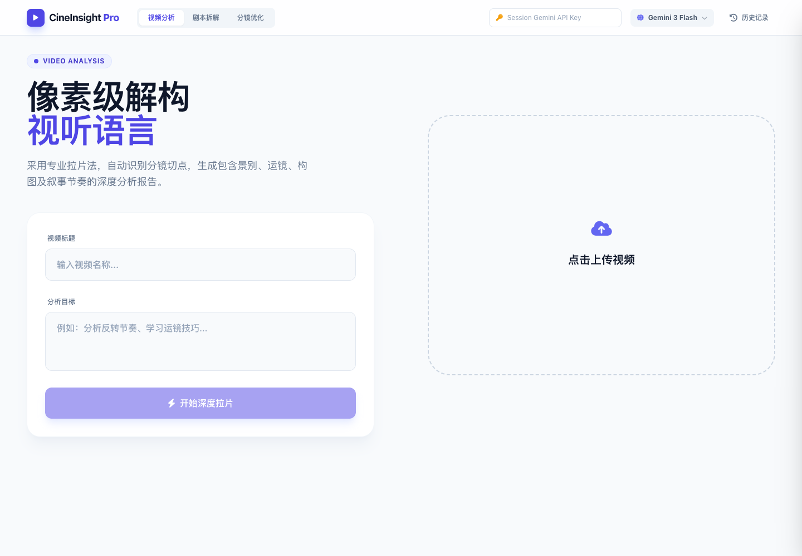
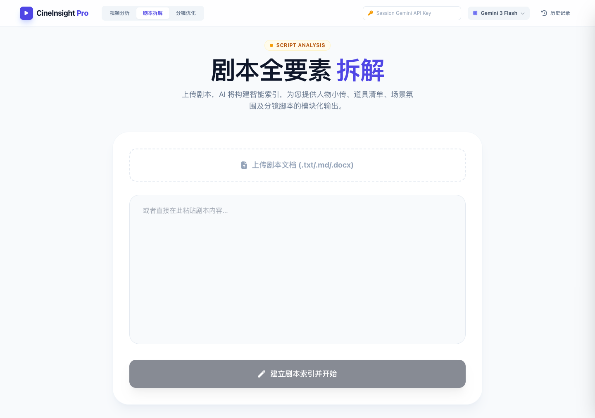

# Pro Video Analyst

面向视频创作者的 AI 拉片与剧本生产工作台。它把视频分析、剧本要素拆解和分镜优化放在同一个浏览器工作流中，并采用会话级 BYOK：模型 Key 只存在于当前页面内存，刷新后自动清除。



## 核心流程

- 视频分析：识别分镜切点，整理景别、运镜、构图和叙事节奏。
- 剧本拆解：从 `.txt`、`.md` 或 `.docx` 提取人物、道具、场景和分镜脚本。
- 分镜优化：结合参考图分析画面风格，生成可继续制作的视频提示词。
- 本地导出：结果可复制为 Markdown/富文本；分析记录保存在当前浏览器。



## Quick Start

需要 Node.js 20 或更高版本，以及一个可用的 Gemini API Key。

```bash
git clone https://github.com/5JjiaLin/pro-video-analyst.git
cd pro-video-analyst
npm ci
npm run dev
```

打开终端显示的本地地址，在顶部的 `Session Gemini API Key` 输入框中填写 Key。Key 不会写入 `localStorage`、仓库文件或构建产物；关闭或刷新页面后需要重新输入。

## 验证

```bash
npm test
npm run build
npm audit --omit=dev
```

## 项目结构

```text
src/
  App.tsx                  # 三类工作流和浏览器交互
  geminiService.ts         # 会话配置校验与模型调用
  geminiService.test.ts    # BYOK 安全边界测试
  types.ts                 # 领域数据类型
docs/
  assets/                  # 当前版本真实页面截图
  ai-studio-metadata.json  # 原始 AI Studio 项目元数据
```

## 安全与隐私边界

- 项目不再把 API Key 注入 Vite 构建产物，也不持久化模型 Key。
- 项目不接收飞书 App Secret，不在浏览器中直连飞书开放接口。
- 视频、剧本和生成结果会发送给用户选择的模型服务；请勿上传无权处理的内容。
- 本项目是创作辅助工具，生成结果需要人工复核。

## License

源码采用 [MIT License](LICENSE)。截图、品牌视觉和示例素材不在 MIT 授权范围内，详见 [ASSET_LICENSE.md](ASSET_LICENSE.md)。
